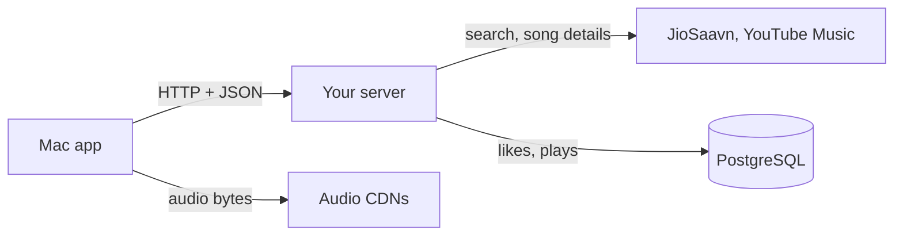

# How the music app works

Read this file first. It is the map. The other three files hold the detail:

| File | What it covers |
|---|---|
| [backend.md](backend.md) | Every Python function: what it does, what it returns, how, who calls it |
| [database.md](database.md) | Every table and column, and which functions read or write it |
| [mac-app.md](mac-app.md) | Every Swift type and function in the Mac app |

## 1. The five parts



| Part | Language | Job |
|---|---|---|
| Mac app | Swift | Shows screens. Plays audio. Holds the queue. |
| Your server | Python (FastAPI) | Searches, groups, ranks, stores. Decides which audio file plays. |
| JioSaavn, YouTube Music | (outside) | Give search results and audio URLs. |
| PostgreSQL | SQL | Stores likes, plays, skips, finishes. |
| Audio CDNs | (outside) | Send the audio bytes **directly to the app**. Audio never passes through your server. |

## 2. Every request the app sends

| App action | Request | Server function | Returns |
|---|---|---|---|
| Type in Search | `GET /search?q=…` | `search` | Songs (no IDs) |
| Play a song | `GET /play/{source}/{id}` | `play` | A redirect (307) to the audio file |
| A song starts / is skipped / ends | `POST /events` | `add_event` | The stored song's ID |
| Tap ♥ | `POST /liked` | `like_song` | The stored song's ID |
| Un-tap ♥ | `DELETE /liked/{id}` | `unlike_song` | Nothing (204) |
| Open Liked Songs | `GET /liked` | `get_liked` | Liked songs |
| Open Recently Played | `GET /recent` | `get_recent` | Recently played songs |

## 3. Three words used everywhere

| Word | Meaning | Example |
|---|---|---|
| **Listing** | One copy of a song on one source. | JioSaavn's copy of *Tum Hi Ho*, id `aRZbUYD7` |
| **Song** | One recording. Holds all its listings. | *Tum Hi Ho*, with 3 listings |
| **Track** | The Mac app's name for a song. | Same as Song, inside the app |

## 4. Two rules behind the design

1. **Search results are not stored.** A song is stored only when you like it or play it. This is called *lazy IDs*.
2. **A stored song's identity never changes.** Its title, artists and duration are copied from its first listing and frozen. New listings are compared against these frozen values. This stops a song from slowly drifting into a different song.

## 5. Where is…?

| I want to find… | File | Function |
|---|---|---|
| How search results are grouped and ranked | `backend/src/music_backend/services/matching.py` | `rank_songs` |
| How two listings are judged "the same recording" | `matching.py` | `same_recording` |
| How the best copy is chosen | `matching.py` | `pick_best` |
| How a stored song is found or created | `backend/src/music_backend/services/library.py` | `resolve_song` |
| How JioSaavn's audio URL is decrypted | `backend/src/music_backend/sources/jiosaavn.py` | `decrypt_media_url` |
| How YouTube audio is found | `backend/src/music_backend/sources/ytmusic.py` | `extract_audio_url` |
| The table definitions | `backend/schema.sql` | — |
| What the app does when you double-click | `mac/NoNonsense/Services/Player.swift` | `play` |
| Discord status | `mac/NoNonsense/Services/Presence.swift` | `Presence.update` |

## 6. How to run it

1. Start the database (it starts automatically after a reboot): `brew services start postgresql@18`
2. Start the server: `cd ~/projects/music/backend && uv run fastapi dev src/music_backend/main.py`
3. Run the tests: `cd ~/projects/music/backend && uv run pytest -q`
4. Build and open the app (Release: the one to use every day; Debug is unoptimised and for self-tests):
   ```bash
   cd ~/projects/music/mac
   xcodebuild -project NoNonsense.xcodeproj -scheme NoNonsense -configuration Release -derivedDataPath build build 2>&1 | grep -E "error:|BUILD"
   open build/Build/Products/Release/NoNonsense.app
   ```
   (or open `mac/NoNonsense.xcodeproj` in Xcode and press ⌘R for a Debug run)
5. The database needs PostgreSQL 18: `schema.sql` uses `uuidv7()`, which older versions do not have.
