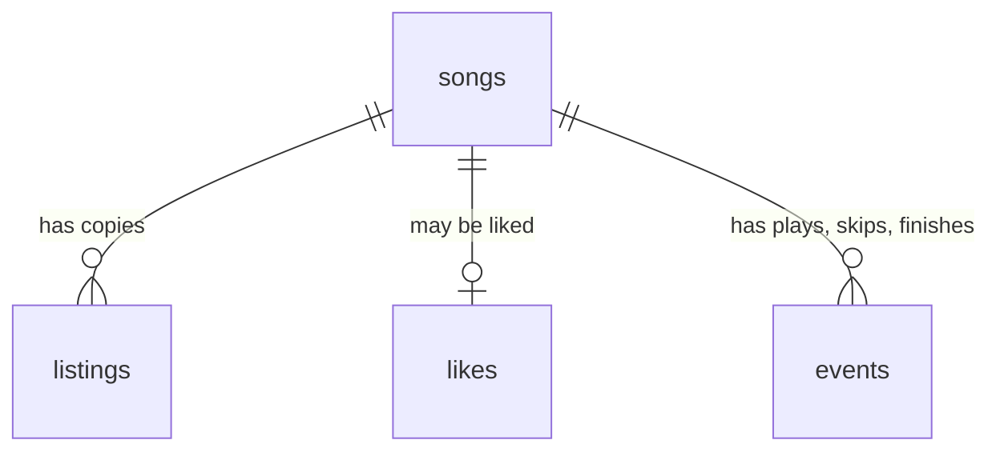

# Database (PostgreSQL 18)

The tables are defined in [`backend/schema.sql`](../backend/schema.sql). The server creates any missing table when it starts.

Two databases exist on your Mac:

| Database | Used by |
|---|---|
| `music` | The real app. |
| `music_test` | The tests. Wiped before every test. |

## 1. The four tables

### `songs` — one row per stored song

| Column | Type | Meaning |
|---|---|---|
| `id` | uuid, primary key | Made by `uuidv7()`: unique, and sorts by creation time. |
| `title` | text | Frozen at creation. |
| `artists` | text[] | Frozen at creation. A list. |
| `duration` | integer | Seconds. Must be > 0 (`CHECK`). |
| `normalised_title` | text, indexed | `normalise(title)`. Stored because `normalise` is Python and Postgres cannot index a Python function. |
| `created_at` | timestamptz | When it was stored. |

The frozen columns are the song's **identity**. `resolve_song` compares new listings against them. They are never updated.

### `listings` — one row per copy of a song

| Column | Type | Meaning |
|---|---|---|
| `source` | text | `jiosaavn` or `ytmusic` (`CHECK`). |
| `source_id` | text | The source's own ID. |
| `song_id` | uuid → `songs.id` | Which song this copy belongs to. Indexed. |
| `title`, `artists`, `album`, `duration` | | As the source gives them. |
| `popularity` | bigint | Play count. `bigint` because YouTube reports billions and `integer` stops at about 2.1 billion. |
| `image` | text | Cover URL. |
| `created_at` | timestamptz | |

**Primary key:** `(source, source_id)` together. The same ID string could exist on two sources.

### `likes` — one row per liked song

| Column | Type | Meaning |
|---|---|---|
| `song_id` | uuid, primary key → `songs.id` | The primary key **is** the "liked at most once" rule. |
| `liked_at` | timestamptz | |

### `events` — one row per play, skip or finish

| Column | Type | Meaning |
|---|---|---|
| `id` | bigint, made by the database | Events need their own ID: one song has many events. |
| `song_id` | uuid → `songs.id` | |
| `type` | text | `play`, `skip` or `finish` (`CHECK`). |
| `position` | integer | Seconds into the song. A skip at 12 s means something different from one at 180 s. |
| `at` | timestamptz | When. |

Index: `(song_id, at)`, for "this song's events, in time order".

## 2. Rules the database enforces

| Rule | How |
|---|---|
| No listing, like or event for a song that does not exist | Foreign keys (`REFERENCES songs (id)`) |
| Deleting a song deletes its listings, like and events | `ON DELETE CASCADE` |
| A song is liked at most once | `likes.song_id` is the primary key |
| No 0-second songs, no unknown sources, no unknown event types | `CHECK` constraints |

## 3. Which function reads or writes which table

| Function | songs | listings | likes | events |
|---|---|---|---|---|
| `resolve_song` | read, write | read, write | | |
| `like` | | | write | |
| `unlike` | | | delete | |
| `record_event` | | | | write |
| `liked_songs` | | read (via `_with_listings`) | read | |
| `recent_songs` | | read (via `_with_listings`) | read | read |

## 4. Connection pool

1. A **connection** is a channel between your Python program and PostgreSQL. Opening one takes work.
2. The **pool** opens connections once, at startup (in `lifespan`).
3. Each request **borrows** a connection (`async with pool.connection() as conn:`) and gives it back at the end of the block.
4. At the end of the block: success → the changes are saved (commit). An error → they are undone (rollback).

Measured on your Mac: a new connection per query took **1.26 ms**; a borrowed one took **0.08 ms**.

## 5. Measured speed

With 1,000,000 events (about 9 years of heavy listening):

| Operation | Time |
|---|---|
| Add one event | 0.25 ms |
| Count one song's skips | 3.7 ms |
| `/recent` (latest 50 songs) | 18 ms |
| Size on disk | 157 MB |

## 6. Useful commands

| Task | Command |
|---|---|
| Open a SQL prompt | `psql music` (type `\q` to leave) |
| List the tables | `psql music -c '\dt'` |
| Show one table's columns | `psql music -c '\d songs'` |
| Count songs | `psql music -c 'SELECT count(*) FROM songs'` |
| Delete all stored songs (and their listings, likes, events) | `psql music -c 'DELETE FROM songs'` |
